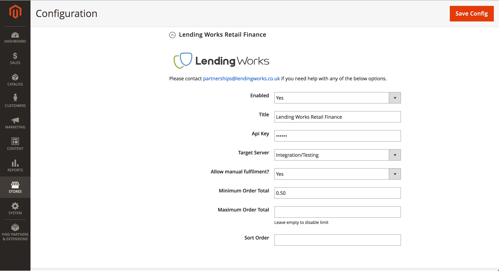
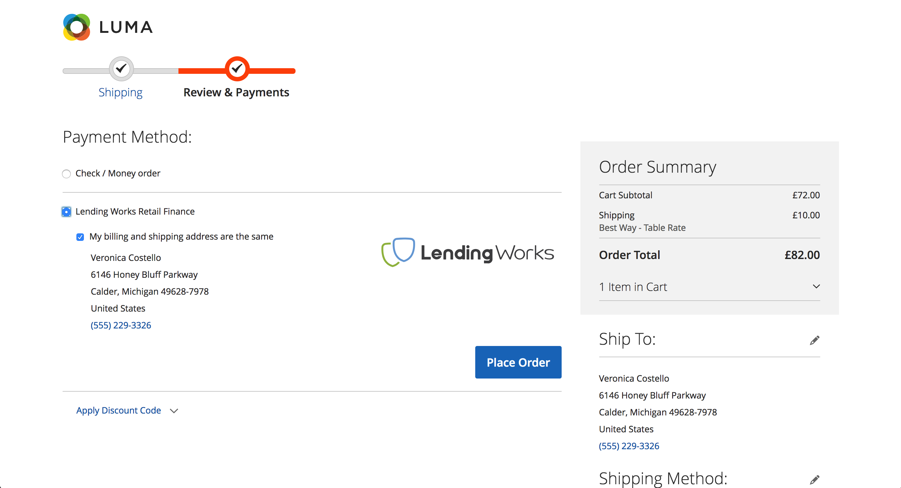
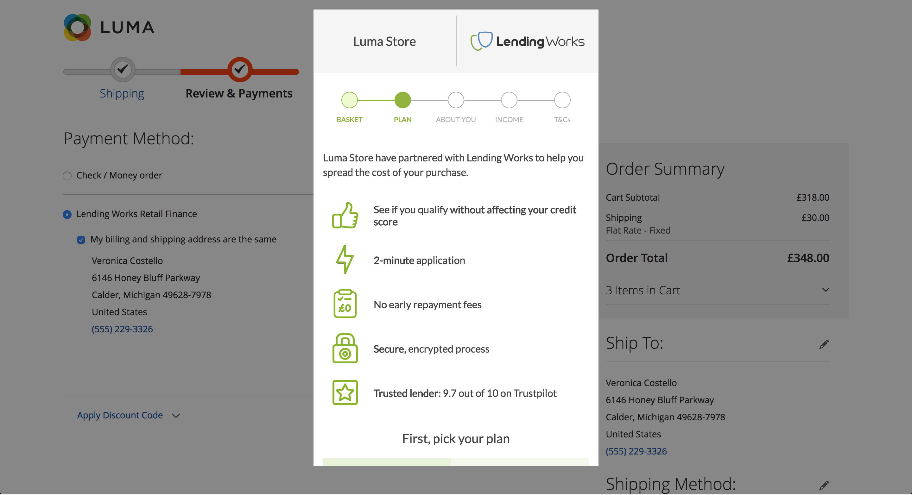
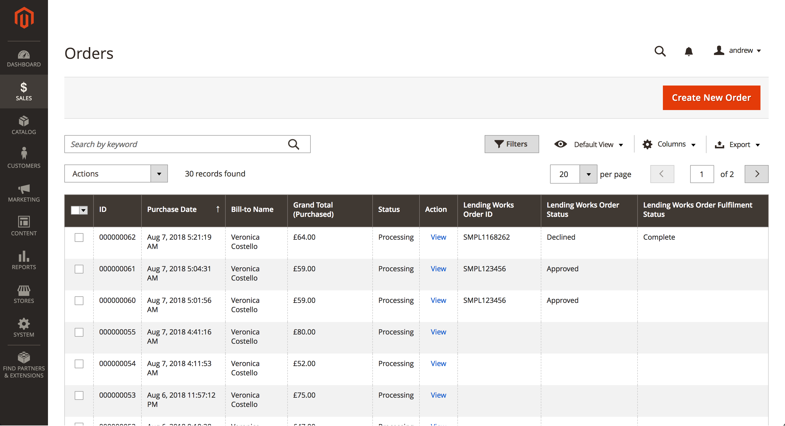
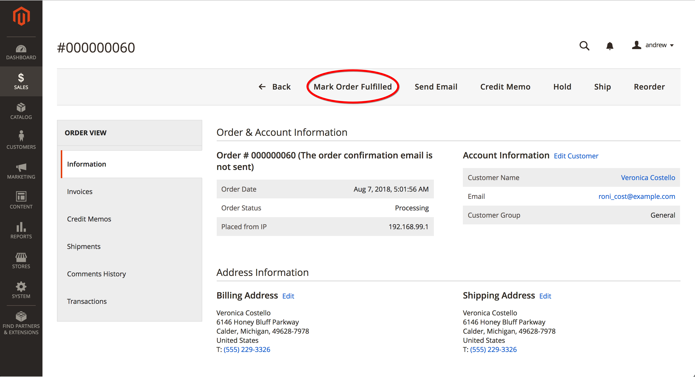
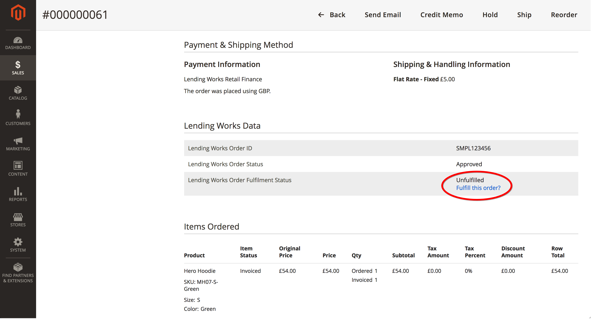

# Lending Works Retail Finance Module

This module will introduce a new payment method to your checkout that allows a user to apply for finance through the Lending Works portal.

## Requirements

- Magento 2
- An API key (contact [partnerships@lendingworks.co.uk](mailto:partnerships@lendingworks.co.uk) for more information on this)
- A shop that operates in British Pounds

## Installation

You can either acquire a release from the Magento Marketplace, or install via composer:

```bash
composer require lendingworks/magento2-retailfinance
```

## Configuration


\ 

The configuration for the payment method in the checkout can be found in the **Stores > Configuration > Sales > Payment Methods** section.

The options are as follows:

- **Enabled** - whether or not to display this option in the checkout for applicable orders
- **Title** - the title this will be given in the checkout
- **Api Key** - here you should paste your API key provided by Lending Works. It will hide itself once saved.
- **Target Server** - here you can choose between `Integration/Testing` and `Production`. This allows for you to send and receive dummy orders on development and testing environments.
- **Allow manual fulfilment?** - if yes, then you will have the option to mark the order as fulfilled from the admin interface - more on this in [order fulfilment](#order-fulfilment)
- **Minimum/Maximum Order Total** - optional parameters to influence whether or not Retail Finance can be offered on an item - if the max is left blank, then no maximum will apply
- **Sort Order** - used to adjust the relative order of the options in the checkout

## Checkout Flow

When Lending Works Retail Finance is selected as a payment method, a call is made to the Lending Works API to create an order in the Lending Works database. 


\ 

When `Place Order` is selected, the Lending Works checkout will be launched via remote javascript. 


\ 

Upon completion of the application, the next step will be determined depending on the result:

- **Approved** - the order will proceed as normal.
- **Declined** - the user will be prompted to choose an alternative payment method, and the ability to try again with Lending Works will be disabled.
- **Referred** - same as `Approved` - however, you may wish to wait to [fulfill this order](#order-fulfilment) until the loan request has been fully approved.
- **Cancelled** - this occurs when a user exits the checkout before it is complete. The order will be abandoned but they may try again if they wish.

## Order Management

Three database fields have been added to both the `Quote` and the `Order` objects:

1. `lendingworks_order_id` - the unique identifier for the order in the Lending Works database
2. `lendingworks_order_status` - the status of the loan-request associated with the order
3. `lendingworks_order_fulfilment_status` - whether or not the order has been completed by the retailer.

You can see all of these fields in the order summary in **Sales > Orders**



\ 

Order statuses gets updated via callback url (**https://{your-domain-name}/lwapi/order/callback**) once registered with us.

A LendingWorks order is updated via webhook when:

- marked as 'expired'
- marked as 'cancelled'
- marked as 'fulfilled'
- you have a 'referred' loan application and  it is
    - approved
    - declined
    - accepted

An example callback request body will look like the following:

```json
{
  "reference":"SMPLXXXXXX",
  "status":"approved",
  "timestamp":1543418504
}
```

## Order fulfilment

Drilling down into the order via the `view` button will allow you to perform manual fulfilment actions. You can do this via the large button at the top:


\ 

Or via a small hyperlink next to the order fulfilment status:


\ 
